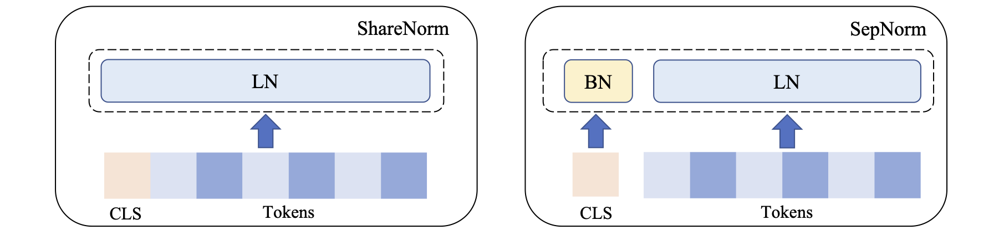

# SepNorm
### [NeurIPS 2023 paper](https://openreview.net/pdf?id=cezKbXsT3V) 

### [Easy to use](SepNorm.ipynb)



## What is SepNorm?
SepNorm, a normalization scheme that separately normalizes embeddings of the [CLS]
symbol and embeddings of other tokens.

## When to use SepNorm?
SepNorm could enhance the result on 
**Computer Vision**:
|               | STL10 ACC@1 | STL10 ACC@5 | Aircraft ACC@1 | Aircraft ACC@5 | SVHN ACC@1 | SVHN ACC@5 | Flower ACC@1 | Flower ACC@5 |
|---------------|-------------|-------------|----------------|----------------|------------|------------|--------------|--------------|
| MAE           | 92.01       | 99.5        | 52.54          | 84.16          | 88.97      | 99.13      | 27.63        | 53.73        |
| + SepNorm     | **93.84**   | **99.7**    | **59.02**      | **86.65**      | **89.18**  | **99.21**  | **32.51**    | **60.92**    |

**Natural Language Processing**:
|                                |           | STS12 | STS13 | STS14 | STS15 | STS16 | STS-B | SICK-R | Avg.  |
|--------------------------------|-----------|-------|-------|-------|-------|-------|-------|--------|-------|
|                                |           |       |       |       |       |       |       |        |       |
| **Unsupervised Training**      |           |       |       |       |       |       |       |        |       |
| $\text{BERT}_\text{base}$      | ShareNorm | 65.28 | 78.82 | 69.65 | 79.02 | 77.21 | 76.4  | **71.74** | 74.04 |
|                                | SepNorm   | **67.01** | **82.16** | **72.48** | **81.38** | **79.11** | **77.56** | 71.36 | **75.87** |
| $\text{RoBERTa}_\text{base}$   | ShareNorm | **68.25** | 81.24 | 72.78 | **81.38** | **80.31** | 79.83 | 68.16 | 76.00 |
|                                | SepNorm   | 66.63 | **82.40** | **74.47** | **82.39** | **80.44** | **81.14** | **69.44** | **76.70** |
|                                |           |       |       |       |       |       |       |        |       |
| **Supervised Training**        |           |       |       |       |       |       |       |        |       |
| $\text{BERT}_\text{base}$      | ShareNorm | **77.72** | 81.07 | **78.97** | **85.15** | **82.00** | 82.36 | **79.74** | 81.00 |
|                                | SepNorm   | 75.32 | **84.41** | 79.94 | 84.91 | 80.87 | **83.63** | 79.61 | **81.23** |
| $\text{RoBERTa}_\text{base}$   | ShareNorm | **77.38** | 80.87 | 78.72 | 84.02 | **82.56** | 83.08 | 78.25 | 80.70 |
|                                | SepNorm   | 75.80 | **84.94** | **80.33** | **85.51** | 82.11 | **84.88** | **79.72** | **81.90** |
|                                |           |       |       |       |       |       |       |        |       |
|                                |           | MR    | CR    | SUBJ  | MPQA  | SST2  | TREC  | MRPC   | Avg.  |
| **Transfer Learning**          |           |       |       |       |       |       |       |        |       |
| $\text{BERT}_\text{base}$      | ShareNorm | **82.78** | 88.79 | **94.69** | **89.86** | **87.94** | **84.44** | **75.99** | **86.36** |
|                                | SepNorm   | **82.82** | **89.08** | 94.30 | 89.70 | **87.97** | 83.88 | 75.21 | 86.14 |
| $\text{RoBERTa}_\text{base}$   | ShareNorm | 84.45 | **91.50** | 93.94 | **89.45** | 90.96 | 86.80 | **76.13** | 87.61 |
|                                | SepNorm   | **85.11** | **91.56** | **94.30** | **89.43** | **91.66** | **90.96** | 75.58 | **88.37** |

**Molecular Properties Prediction**:
| Dataset     | ZINC       | ZINC (subset) | MolHIV     |
|-------------|------------|---------------|------------|
| Metrics     | Mean absolute error↓ | Mean absolute error↓  | AUC↑       |
| Graphormer  | 0.069      | 0.164         | 73.36%     |
| + SepNorm   | **0.052**  | **0.144**     | **75.64%** |


## How to use SepNorm?

Replace the normalization layer with SepNorm:
```
class SepNorm(nn.Module):
    def __init__(self, hidden_size, cls_norm=nn.BatchNorm1d, tok_norm=nn.LayerNorm):
        super().__init__()
        self.cls_norm_layer = cls_norm(hidden_size)
        self.tok_norm_layer = tok_norm(hidden_size)
    def forward(self, x):
        n, l, d = x.shape
        cls_states, hidden_states = torch.split(x, [1, l-1], dim=1)
        cls_states = self.cls_norm_layer(cls_states.view(n,d))[:, None, :]
        hidden_states = self.tok_norm_layer(hidden_states)
        hidden_states = torch.cat((cls_states, hidden_states), dim=1)
        return hidden_states
```

## Contact
Reach us at xiaohui.chen@tufts.edu and yinkai.wang@tufts.edu or open a GitHub issue.

## Citing SepNorm
If you use our code in your work, please consider citing:

```
@article{chen2024separate,
  title={On Separate Normalization in Self-supervised Transformers},
  author={Chen, Xiaohui and Wang, Yinkai and Du, Yuanqi and Hassoun, Soha and Liu, Liping},
  journal={Advances in Neural Information Processing Systems},
  volume={36},
  year={2024}
}
```
